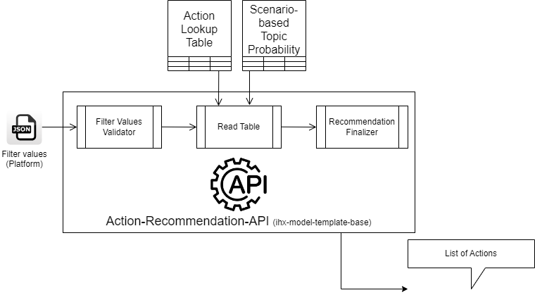

Action-Recommendation-API
=========================================
This API provides action recommendations to avoid IRs during claim transactions

Solution Flow Diagram
---------------------


Implementation
--------------
### Development Setup
Setup the conda environment and load the necessary requirements.
```python
conda create --name=ACTIONS python=3.8
# accept all inputs
# Install requirements [Development]
pip install -r requirements-dev.txt
pip install -r requirements.txt

# Install requirements [Prd]
pip install -r requirements.txt
```

### Service Setup
Export environment variables
```shell
export APP_ACRONYM=ACTIONS
export MODE=development
export CFG_KEY='?'
export CFG_SECRET="?"
```
```python
uvicorn app.ACTIONS_app:app --port 8123 --host 0.0.0.0
```
Open browser on url:
- http://server_ip:8123/docs  

Code changes made will be auto loaded for action.

[VERSIONS]
### v1.0.0 -> 2nd Aug 2022

[TODO]
- [ ] Feature-1
    - [x] Sub-Feature-1
    - [ ] Sub-Feature-2
- [x] Feature-1
- [ ] Feature-2
